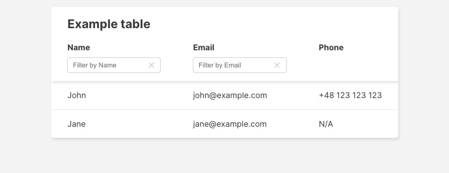

# Reusable Table

This Table component is a reusable solution featuring customizable columns, including column-based filtering with useDebounce for optimized performance. It supports loading and error states, responsive design, and accessibility, making it adaptable for various data display needs.

## Example usage

```typescript
import { useState } from 'react';

import { Table } from '@/lib/components/table';

export const Example = () => {
	const [filters, setFilters] = useState({});
	const exampleTable = {
		columns: [
			{ key: 'name', label: 'Name', filterable: true },
			{ key: 'email', label: 'Email', filterable: true },
			{ key: 'phone', label: 'Phone' },
		],
		rows: [
			{ name: 'John', email: 'john@example.com', phone: '+48 123 123 123' },
			{ name: 'Jane', email: 'jane@example.com' },
		],
	};

	const handleChangeFilter = (columnKey: string, value: string) => {
		setFilters((prevValues) => ({ ...prevValues, [columnKey]: value }));
	};

	const handleClearFilter = (columnKey: string) => {
		setFilters((prevValues) => ({ ...prevValues, [columnKey]: '' }));
	};

	return (
		<Table
			// required props:
			columns={exampleTable.columns}
			rows={exampleTable.rows}
			// optional props:
			caption="Example table"
			height="fit-content"
			filters={filters}
			onFilterChange={handleChangeFilter}
			onClearFilter={handleClearFilter}
			isDataLoading={false}
			isDataError={false}
		/>
	);
};
```

Output:



## Props

The Table component accepts the following props:

```typescript
export type TableProps = {
	columns: TableColumn[];
	rows: TableRow[];
	caption?: string;
	filters?: TableFilter;
	onFilterChange?: (key: string, value: string) => void;
	onClearFilter?: (key: string) => void;
	height?: Size;
	isDataLoading?: boolean;
	isDataError?: boolean;
};
```

- `columns`: An array of TableColumn objects defining the structure of the table.
- `rows`: An array of TableRow objects containing the data to be displayed.
- `caption` (optional): A string to be used as the table caption.
- `filters` (optional): An object containing the current filter values.
- `onFilterChange` (optional): A callback function to handle filter changes.
- `onClearFilter` (optional): A callback function to clear a specific filter.
- `height` (optional): A height of the table container.
- `isDataLoading` (optional): A boolean indicating if data is being loaded.
- `isDataError`(optional): A boolean indicating if there was an error loading data.

## Features

1. Filtering (optional)\
   The Table component supports column-based filtering. Each column can be made filterable by setting the filterable property to true in the column definition.

```typescript
const TABLE_COLUMNS: TableColumn[] = [
	{
		key: 'name',
		label: 'Name',
		filterable: true,
	},
	{
		key: 'phone',
		label: 'Phone',
	},
	{
		key: 'email',
		label: 'Email',
		filterable: true,
	},
];
```

2. Loading State (optional)\
   When isDataLoading is set to true, the table displays a skeleton loading state.

```typescript
	if (isDataLoading) {
		return <TableBodySkeleton columnsCount={columns.length} rowsCount={15} />;
	}
```

3. Error Handling (optional)\
   If isDataError is true, the table displays an error message.

```typescript
	if (isDataError) {
		return <TableBodyError columnsCount={columns.length} />;
	}
```

4. No Results\
   When there are no rows to display, a "No results" message is shown.

```typescript
	if (rows.length === 0) {
		return <TableBodyNoResults columnsCount={columns.length} />;
	}
```

5. Responsive Design\
   The table is designed to be responsive, with a scrollable container and a sticky header.

6. Accessibility\
   The component includes various accessibility features, such as proper ARIA labels and roles.

## Styling

The Table component uses CSS modules for styling. The main styles are defined in Table.module.css, with additional styles for specific parts like the header and body.
To customize the appearance, you can modify the CSS variables defined at the top of the Table.module.css file:

```css
.tableContainer {
	--background-color: #fff;
	--black-color: #333;
	--border-radius: 5px;
	--box-shadow: 2px 4px 5px 0 rgba(0, 0, 0, 0.1);
	--outline: 2px solid var(--primary-color);
	--primary-color: #48cfcb;
	--primary-color-light: rgba(72, 207, 203, 0.1);
	--transition-duration: 0.2s;
	--warn-color: #ff6347;
}
```

## Internal Components

The Table component is composed of several internal components:

1. `TableHeader`: Renders the table header with filterable columns.
2. `TableContent`: Manages the display of table content based on loading, error, and data states.
3. `TableBody`: Renders the main table body with rows of data.
4. `TableBodySkeleton`: Displays a loading skeleton when data is being fetched.
5. `TableBodyError`: Shows an error message when data fetching fails.
6. `TableBodyNoResults`: Displays a message when there are no results to show.

## Context

The Table component uses React Context to pass down props to child components, reducing prop drilling.

```typescript
import { createContext, useContext } from 'react';

import type { TableProps } from './shared/types';

const TableContext = createContext<TableProps | undefined>(undefined);

export const useTableContext = () => {
	const context = useContext(TableContext);

	if (!context) {
		throw new Error('useTableContext must be used within a TableContextProvider');
	}

	return context;
};
```

## Utilities

The component includes utility functions for filtering rows and a custom hook for debouncing filter changes:

- filterRows: Filters the table rows based on the current filters.
- useDebounce: A custom hook that debounces value changes, useful for optimizing filter performance.
